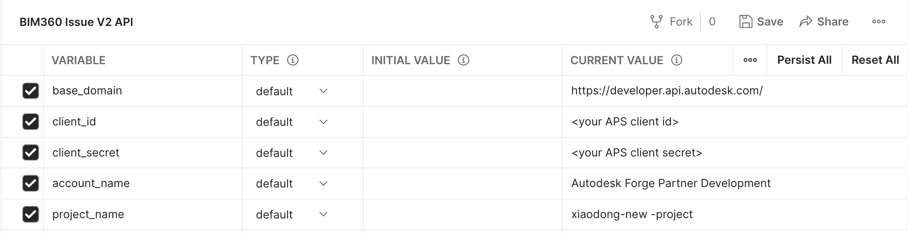
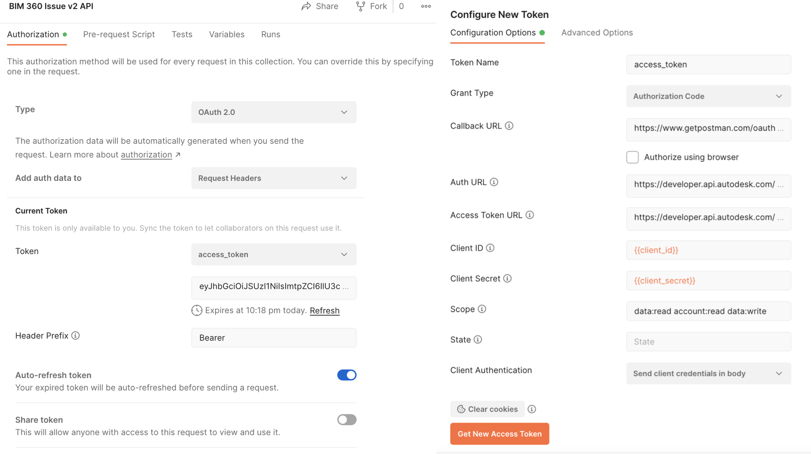
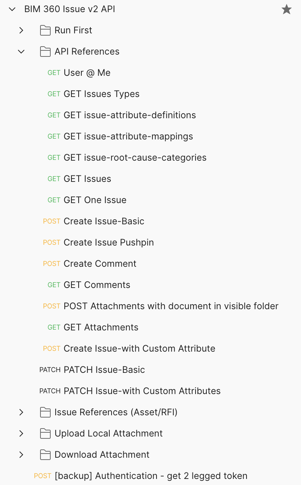

# Postman Collection for BIM360 Issues API 

[](https://www.getpostman.com/)

[](https://aps.autodesk.com/en/docs/bim360/v1/overview/field-guide/issues/)


[](http://opensource.org/licenses/MIT)

## Description

This repository provides a [postman](https://www.getpostman.com/downloads/) collection that demonstrates the usage of [Issues API of Autodesk BIM360](https://aps.autodesk.com/en/docs/bim360/v1/overview/field-guide/issues/) .  

The API supports **3 legged token** only. This collection takes **[Inheriting auth](https://learning.getpostman.com/docs/postman/sending-api-requests/authorization/#inheriting-auth)** to apply 3-legged token to every endpoint in the collection automatically
 

## Setup

1.  **APS Account**: Learn how to create a APS Account, activate the subscription and create an app by [this tutorial](http://aps.autodesk.com/tutorials/#/account/). Ensure to select API Type **BIM360**. Get APS _client id_, _client secret_ and  _callback url_. Please register Forge app with the _callback url_ as 

    ```https://www.getpostman.com/oauth2/callback```

2. **BIM360 Account and project**: must be Account Admin to add the app integration. [Learn about provisioning](https://aps.autodesk.com/blog/bim-360-docs-provisioning-forge-apps). Make a note with the __account name__

3. Create a project of BIM360 or reuse existing project. Make a note with the __project name__

4. Follow the [product help document of BIM360](https://knowledge.autodesk.com/support/bim-360/learn-explore/caas/CloudHelp/cloudhelp/ENU/BIM360D-Administration/files/About-Project-Admin/BIM360D-Administration-About-Project-Admin-about-issues-html-html.html) to create some test entities
  -  common issue
  -  pushpin issue with document
  -  create some custom attributes definitions and attach them to issues. 
  -  create some comments with issues
  -  attach some attachments to issues (either with documents from visible folder or from local uploaded file)
  -  create some custom issue type and root causes. specify them with issues

5. (Optional) Create a couple of assets in Assets module. This is to test fetching/creating reference with Issues & Assets.

6.  Clone this repository or download it. It's recommended to install [GitHub Desktop](https://desktop.github.com/). To clone it via command line, use the following (**Terminal** on MacOSX/Linux, **Git Shell** on Windows):

    ```git clone https://github.com/Autodesk-Forge/forge-autodesk.docs.issue.api-postman.collection```

7. Import the collection and environment files to Postman

8. In environment, input _client id_, _client secret_, _account name_ and _project name_.

   <p align="center"></p>  

9. In context menu of collection >> **Edit**, switch to the tab **Authorization**. Click **Get New Access Token**, input the variables as below:

   - Grant Type ``Authorization Code``
   - Callback URL  ``https://www.getpostman.com/oauth2/callback``
   - Auth URL  ``https://developer.api.autodesk.com/authentication/v1/authorize``
   - Access Token URL  ``https://developer.api.autodesk.com/authentication/v1/gettoken``

   - Client ID ``{{client_id}}``
   - Client Secret ``{{client_secret}}``
   - Scope ``data:read data:write``
   - Client Authentication ``Send Client credentials body``

   <p align="center"></p> 
 
 10. Click **Get New Access Token**, it will direct to login Autodesk user account, after it succeeds, the token will be generated. Click **Use Token**.  
   
## API Test

1. Assume the steps of **Setup** have been performed and the access token is ready.

2. Run the scripts in **Run First**. It will get account(hub) id, project id and one user id(for assignee), location id,one document urn(for attaching to issue).   

3. Run the endpoints in **API References**. Follow [API References](https://aps.autodesk.com/en/docs/bim360/v1/reference/http/issues-v2-users-me-GET/) to verify if the APIs work well. Try to change the parameters in various scenarios to see how it goes. Check UI if it works well with API (such as creating/patching new issue and creating new comments etc. )
    
    <p align="center"></p>  

4. To test downloading original files of attachments, run scripts in  **Download Attachment**. It assumes one issue is available with some attachments. 
  - The 01 step will return information of first attachment. If urnType is **dm**, the urn pattern is like a base64 encoded string. The post script will transform it to a version urn pattern. If the urnType is **oss**, it is storage urn already, the post script will get bucket key and object key directly 
  - if urnType is **dm**, run 02 step to get storage urn by Data Management API, finally get bucket key and object key 
  - The 03 step is to get S3 signed url
  - The 04 step is to download the file by the signed url

5. To test uploading local files as attachments, run scripts in  **Upload Local Attachment**. It assumes one issue is available.
 - The 01 step create an attachment for the issue with  urnType = **oss**. It will create the storage in the invisible folder of issue
 - The 02 step will generate S3 signed url for uploading by Data Management API
 - The 03 step is to upload the local binary file by the signed url
 - The 04 step is to complete the uploading by Data Management API
 - The 05 step is to notify the server to associate the file with the issue.

 To verify if the attachment is attached successfully, follow the steps in Test #4. 

4. (Optional) In BIM360, the reference of issue with assets or rfis is managed by Relationships API, which is a common across different modules. To work with **Issue>>References**, you can use [Relationship API](https://aps.autodesk.com/en/docs/acc/v1/reference/http/relationship-service-v2-search-relationships-GET/). This sample Postman collection includes a few sample usages. For more detail about Relationships API, please take a look [at this blog](https://aps.autodesk.com/blog/bim-360acc-relationships-api). 

  -  The 01 step is to get supported Relationships. you can check those that are available with BIM360 issues.
  -  The 02 step is to get one asset id by [Asset API](https://aps.autodesk.com/en/docs/bim360/v1/reference/http/assets-assets-v2-GET/)
  -  The 03 step is add reference between one issue and one asset
  -  The 04 step get all referenced assets of one issue s
    
**Blogs**:
- [Forge Blog](https://aps.autodesk.com)
- [Field of View](https://fieldofviewblog.wordpress.com/), a BIM focused blog

## License

This sample is licensed under the terms of the [MIT License](http://opensource.org/licenses/MIT). Please see the [LICENSE](LICENSE) file for full details.

## Written by

Xiaodong Liang [@coldwood](https://twitter.com/coldwood), Developer Advocate and Support team